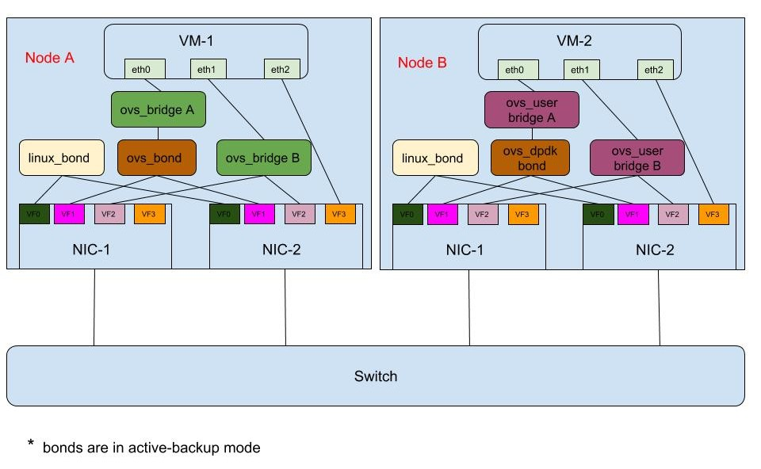

# NICPartitioningValidation
NIC Partitioning is a TripleO feature setup by os-net-config mostly.
This repo outlines the standalone/full stack templates required to setup and validate NIC partitioning feature setup by os-net-config.

# Standalone validation
The standalone validation would require 2 baremetal machines with SR-IOV capable NICs. The validation procedure will generate the templates required for NIC partitioning and run os-net-config to create the various network objects (linux bond, ovs bond, ovs bridge, ovs user bridge, dpdk bond, vlan interface). Later ping tests could be run between these 2 machines and verify the setup created.
The setup will look like


1. If the NIC Partitioning feature shall use VF's for DPDK then its required to setup hugepages, IOMMU on the host machine. The set_boot_params.sh script shall set the bootparams to enable IOMMU and 1G hugepages. The number of hugepages could be changed if required. This script needs to be run as root user.

```bash
sed 's/^\(GRUB_CMDLINE_LINUX=".*\)"/\1 iommu=pt intel_iommu=on default_hugepagesz=1GB hugepagesz=1G hugepages=10"/g' -i /etc/default/grub
grub2-mkconfig -o /etc/grub2.cfg
```
Reboot the machine after running the set_boot_params.sh

2. The DPDK params shall be set for the host machine. The set_dpdk_params.sh will apply the DPDK params (pmd_cpu_mask, lcore_mask, socket_memory). The CPUs/Socket memory could be customized according to the  NUMA placement of the NIC available for partitioning. Its recommended to use atleast 1 physical core/ 2 Hyperthreads per NUMA for PMDs and 1 core for HOST processes. The below parameters needs to be configured inline with the requirements of OVS-DPDK.

```bash
export socket_mem="1024,1024"
export pmd_cpus="2,12,26,36"
export host_cpus="0,24"
```
Run the script with the above parameters configured 
```bash
./set_dpdk_params.sh
```

3. Generate a config.yaml with all the desired network objects. A sample nic-config yaml is supplied for DPDK and non DPDK use cases. The nic_config_gen.py would generate the config.yaml using the sample yaml files and value.yaml. The sample config file has placeholder for configurations like PF name, VF's VLAN tag for the network and value.yaml has the values of these platform configurations.

```bash
python nic_config_gen.py -v value.yaml -s config_dpdk.yaml -o config.yaml
```
The generated config.yaml will have the placeholder's filled :)

4. Run os-net-config with the generated config.yaml and create the environment for testing

```bash
os-net-config --config config.yaml --debug
```
Now the environment is available for testing !!!

Testing : WIP
