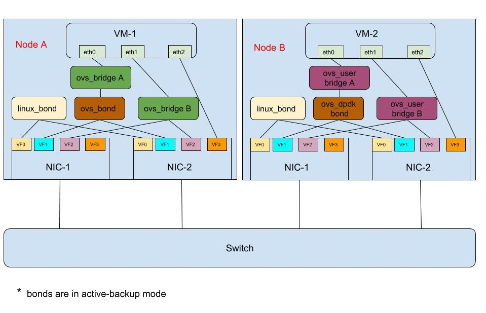

# NICPartitioningValidation
NIC Partitioning is a TripleO feature setup by os-net-config mostly.
This repo outlines the standalone/full stack templates required to setup and validate NIC partitioning feature setup by os-net-config.

# Standalone validation
The standalone validation would require 2 baremetal machines with SR-IOV capable NICs. The validation procedure will generate the templates required for NIC partitioning and run os-net-config to create the various network objects (linux bond, ovs bond, ovs bridge, ovs user bridge, dpdk bond, vlan interface). Later ping tests could be run between these 2 machines and verify the setup created.
The setup shall look like


This setup will validate
* linux bond
* SR-IOV VF
* ovs bond
* ovs dpdk bond
* ovs bridge
* ovs user bridge
* dpdk port

Prerequisites:
* Virtualisation tools like libvirt, virt-install, qemu-kvm shall be installed
* In /etc/libvirt/qemu.conf, change the permissions for user and group
```
  user = 'qemu'
  group = "hugetlbfs"
```
* rhel_guest_7.xxx.qcow2 image shall be available at ``/var/lib/libvirt/images/`` with user: qemu and group:hugetlbfs
* The directory /var/lib/vhost_sockets/ is created with user: qemu and group:hugetlbfs
* The rhel_guest_7.xxx.qcow2 shall have root password set using virt-customize
```bash
  virt-customize -a rhel_guest_7.xxx.qcow2 --run-command 'yum remove cloud-init* -y'
  virt-customize -a rhel_guest_7.xxx.qcow2 --root-password password:****
```


## Node - A setup ##
The Node-A setup involves will have linux bond, SR-IOV VF, ovs bond, ovs bridge.

1. SR-IOV requires IOMMU to be enabled.

```bash
sed 's/^\(GRUB_CMDLINE_LINUX=".*\)"/\1 iommu=pt intel_iommu=on"/g' -i /etc/default/grub
grub2-mkconfig -o /etc/grub2.cfg
```
Reboot the Node-A

2. Generate a config.yaml with all the desired network objects. A sample nic-config yaml is supplied for non DPDK use cases (templates/config_no_dpdk.yaml). The python script nic_config_gen.py would generate the config.yaml using the sample yaml files and value.yaml. The sample config file has placeholder for configurations like PF name, VF's VLAN tag for the network and value.yaml has the values of these platform configurations.

```bash
python nic_config_gen.py -v ../templates/value.yaml -s ../templates/config_no_dpdk.yaml -o ../templates/config.yaml
```
The generated config.yaml will have the placeholder's filled :)

3. Run os-net-config with the generated config.yaml and create the environment for testing

```bash
os-net-config --config ../templates/config.yaml --debug
```
The ifcfgs for the network objects in config.yaml would be generated and ifup of these ifcfgs would be invoked.

```bash
cat /etc/sysconfig/network-scripts/ifcfg-lnx_bond
# This file is autogenerated by os-net-config
DEVICE=lnx_bond
ONBOOT=yes
HOTPLUG=no
NM_CONTROLLED=no
PEERDNS=no
MACADDR="ce:36:6b:b8:7f:bb"
BONDING_OPTS="mode=active-backup"
BOOTPROTO=static
IPADDR=10.10.112.25
NETMASK=255.255.255.0
```

```bash
cat /etc/sysconfig/network-scripts/ifcfg-br-bond
# This file is autogenerated by os-net-config
DEVICE=br-bond
ONBOOT=yes
HOTPLUG=no
NM_CONTROLLED=no
PEERDNS=no
DEVICETYPE=ovs
TYPE=OVSBridge
OVS_EXTRA="set bridge br-bond fail_mode=standalone -- del-controller br-bond"
```

```bash
cat /etc/sysconfig/network-scripts/ifcfg-bond_ovs
# This file is autogenerated by os-net-config
DEVICE=bond_ovs
ONBOOT=yes
HOTPLUG=no
NM_CONTROLLED=no
PEERDNS=no
DEVICETYPE=ovs
TYPE=OVSPort
OVS_BRIDGE=br-bond
DEVICETYPE=ovs
TYPE=OVSBond
BOND_IFACES="p4p1_5 p4p2_5"
OVS_OPTIONS="bond_mode=active-backup"
```

4. Launch a VM with a network connected to br-bond

```bash
virt-install --ram 16384 --vcpus 4 --os-variant rhel7  --disk \
path=/var/lib/libvirt/images/rhel75.qcow2,device=disk,bus=virtio,format=qcow2 \
--noautoconsole --vnc --network bridge:br-bond,model=virtio,virtualport_type=openvswitch --cpu \
host-model --dry-run --print-xml --name ovs_guest  > ovs_guest.xml

virsh define ovs_guest.xml
virsh start ovs_guest
```

## Node - B setup ##
The Node-B setup involves will have linux bond, SR-IOV VF, dpdk bonds, ovs user bridge, dpdk ports.

1. Its required to set hugepages, IOMMU on the host machine inorder to support SR-IOV and DPDK. The set_boot_params.sh script shall set the bootparams to enable IOMMU and 1G hugepages. The number of hugepages could be changed if required. This script needs to be run as root user.

```bash
sed 's/^\(GRUB_CMDLINE_LINUX=".*\)"/\1 iommu=pt intel_iommu=on default_hugepagesz=1GB hugepagesz=1G hugepages=10"/g' -i /etc/default/grub
grub2-mkconfig -o /etc/grub2.cfg
```
Reboot the machine after running the set_boot_params.sh

2. The DPDK params shall be set for the host machine. The set_dpdk_params.sh will apply the DPDK params (pmd_cpu_mask, lcore_mask, socket_memory). The CPUs/Socket memory could be customized according to the  NUMA placement of the NIC available for partitioning. Its recommended to use atleast 1 physical core/ 2 Hyperthreads per NUMA for PMDs and 1 core for HOST processes. The below parameters needs to be configured inline with the requirements of OVS-DPDK.

```bash
export socket_mem="1024,1024"
export pmd_cpus="1,21"
export host_cpus="0,20"
```
Run the script with the above parameters configured
```bash
./set_dpdk_params.sh
```

3. Generate a config.yaml with all the desired network objects. A sample nic-config yaml is supplied for DPDK use case (config_dpdk.yaml). The nic_config_gen.py would generate the config.yaml using the sample yaml files and value.yaml. The sample config file has placeholder for configurations like PF name, VF's VLAN tag for the network and value.yaml has the values of these platform configurations.

```bash
python nic_config_gen.py -v ../templates/value.yaml -s ../templates/config_dpdk.yaml -o ../templates/config.yaml
```
The generated config.yaml will have the placeholder's filled :)

4. Run os-net-config with the generated config.yaml and create the environment for testing

```bash
os-net-config --config ../templates/config.yaml --debug
```

5. Launch a VM with a network connected to br-bond

```bash
virt-install --ram 16384 --vcpus 4 --os-variant rhel7  --disk \
path=/var/lib/libvirt/images/rhel75.qcow2,device=disk,bus=virtio,format=qcow2 \
--noautoconsole --vnc --network vhostuser,source_type=unix,source_path=/var/lib/vhost_sockets/dpdkvhostclient0,source_mode=server,model=virtio --cpu \
host-passthrough --memorybacking hugepages=yes --dry-run --print-xml --name dpdk_guest  > dpdk_guest.xml

ovs-vsctl add-port br-vfs dpdkvhostclient0 -- set Interface dpdkvhostclient0 type=dpdkvhostuserclient options:vhost-server-path=/var/lib/vhost_sockets/dpdkvhostclient0 ofport_request=1
```

Now edit the dpdk_guest.xml in accordance with the HOST machine EPA parameters
* Replace vcpu configuration with

```xml
  <vcpu placement='static'>4</vcpu>
  <cputune>
    <shares>8192</shares>
    <vcpupin vcpu='0' cpuset='3'/>
    <vcpupin vcpu='1' cpuset='23'/>
    <vcpupin vcpu='2' cpuset='5'/>
    <vcpupin vcpu='3' cpuset='25'/>
    <emulatorpin cpuset='3'/>
  </cputune>
  <numatune>
    <memory mode='strict' nodeset='1'/>
    <memnode cellid='0' mode='strict' nodeset='1'/>
  </numatune>
```

* Replace memoryBacking configuration with

```xml
  <memoryBacking>
    <hugepages>
      <page size='1048576' unit='KiB' nodeset='0'/>
    </hugepages>
  </memoryBacking>
```

* Replace cpu configuration with

```xml
  <cpu mode="host-passthrough">
    <numa>
      <cell id='0' cpus='0-3' memory='16777216' unit='KiB' memAccess='shared'/>
    </numa>
  </cpu>
```

Launch the dpdk_guest now

```bash
virsh define dpdk_guest.xml
virsh start dpdk_guest
```

Now the environment is available for testing !!!

## Testing

In Node-A, login to the guest and set ip address for eth0
```bash
virsh console ovs_guest
login: root
password: ****

[root@localhost ~]# ifconfig eth0 10.10.120.8
[root@localhost ~]# ip a
1: lo: <LOOPBACK,UP,LOWER_UP> mtu 65536 qdisc noqueue state UNKNOWN group default qlen 1000
    link/loopback 00:00:00:00:00:00 brd 00:00:00:00:00:00
    inet 127.0.0.1/8 scope host lo
       valid_lft forever preferred_lft forever
    inet6 ::1/128 scope host
       valid_lft forever preferred_lft forever
2: eth0: <BROADCAST,MULTICAST,UP,LOWER_UP> mtu 1500 qdisc pfifo_fast state UP group default qlen 1000
    link/ether 52:54:00:3c:68:ca brd ff:ff:ff:ff:ff:ff
    inet 10.10.120.8/8 brd 10.255.255.255 scope global eth0
       valid_lft forever preferred_lft forever

```

In Node-B do
```bash
virsh console ovs_guest
login: root
password: ****

[root@localhost ~]# ifconfig eth0 10.10.120.10
[root@localhost ~]# ip a
1: lo: <LOOPBACK,UP,LOWER_UP> mtu 65536 qdisc noqueue state UNKNOWN group default qlen 1000
    link/loopback 00:00:00:00:00:00 brd 00:00:00:00:00:00
    inet 127.0.0.1/8 scope host lo
       valid_lft forever preferred_lft forever
    inet6 ::1/128 scope host
       valid_lft forever preferred_lft forever
2: eth0: <BROADCAST,MULTICAST,UP,LOWER_UP> mtu 1500 qdisc pfifo_fast state UP group default qlen 1000
    link/ether 52:54:00:27:9c:8c brd ff:ff:ff:ff:ff:ff
    inet 10.10.120.10/8 brd 10.255.255.255 scope global eth0
       valid_lft forever preferred_lft forever

[root@localhost ~]# ping 10.10.120.8 -c 4
PING 10.10.120.8 (10.10.120.8) 56(84) bytes of data.
64 bytes from 10.10.120.8: icmp_seq=1 ttl=64 time=0.194 ms
64 bytes from 10.10.120.8: icmp_seq=2 ttl=64 time=0.159 ms
64 bytes from 10.10.120.8: icmp_seq=3 ttl=64 time=0.137 ms
64 bytes from 10.10.120.8: icmp_seq=4 ttl=64 time=0.123 ms

--- 10.10.120.8 ping statistics ---
4 packets transmitted, 4 received, 0% packet loss, time 3005ms
rtt min/avg/max/mdev = 0.123/0.153/0.194/0.028 ms
```

With this test we can conclude that the connectivity is established using NIC Partitioning for network objects
* ovs_bridge
* ovs_bonds
* ovs_dpdk_bond
* ovs_user_bridge.

WIP: Repeat similar tests for other network objects
